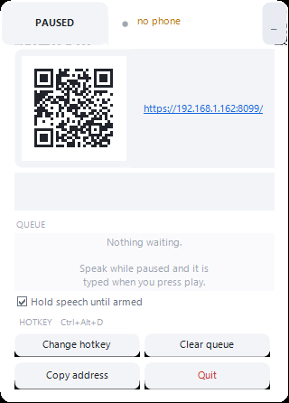
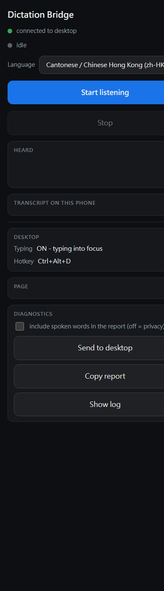

# Dictation Bridge（简体中文）

在 iPhone 上说话，字就会出现在 Windows 电脑当前聚焦的窗口里。

手机用 Web Speech API 听语音，每说完一句就 POST 给电脑上的小程序，它用 `SendInput`
把字敲进去。一个全局快捷键决定是否真的打字，所以第一次点击之后，手机就可以放着不管。

语言版本：[English](README.md) · [繁體中文](README.zh-Hant.md) · [简体中文](README.zh-Hans.md)






## 它会产生的文件

所有内容都放在 exe 旁边的 `data\` 文件夹里，首次运行就会创建。exe 本身不会被修改。

| 文件 | 说明 |
| --- | --- |
| `dictation-bridge.cer` | 需要安装到手机上的证书，只有公开部分，没有私钥。 |
| `dictation-bridge.pfx` | 同一张证书连同私钥，提供 HTTPS 需要用到。 |
| `dictation-bridge.log` | 电脑端的运行记录。 |
| `diagnostics.log` | 手机提交的报告，达到 4 MB 会改名为 `diagnostics.log.1`。 |
| `dictation-bridge-hotkey.txt` | 你选择的快捷键。 |
| `dictation-bridge-position.txt` | 面板停放的位置。 |

删除整个文件夹等于完全重置，包括证书。但程序运行期间请不要删除。

## 使用方法

1. 运行 `DictationBridge.exe`，会出现一个小浮动面板，右下角还有托盘图标。
2. 在手机上打开它显示的地址，例如 `https://192.168.1.162:8080/`。
3. 点一次 **Start listening**，如果询问就授予麦克风权限。
4. 之后直接说话就行。在电脑上按 **Ctrl+Alt+D** 开始／停止打字。

面板显示红色 `DISARMED` 表示尚未启用，这是刻意设计的：程序启动时一定是停用状态，
这样重启也不会恰好把字打进你不想被打字的窗口。停用期间说的话会先暂存，一启用就立刻打出去。

### 首次设置证书

iOS 只在安全页面上开放语音识别，所以程序用自签名证书走 HTTPS。iOS Safari 没有
macOS Safari 那个「仍要继续」按钮，因此证书需要安装一次：

1. 把 `data\dictation-bridge.cer` 传到手机并点击它。
2. 设置 > 通用 > VPN 与设备管理 > 点击描述文件 > 安装。
3. 设置 > 通用 > 关于本机 > 信任证书设置 > 开启它。
4. 打开第 2 步的网址。

**只需要做一次。** 电脑会保留这张证书，下次运行直接沿用，所以重开程式或者重开机都
不需要再装。

证书同时包含 `dictation-bridge.local` 这个名称。如果手机解析得到，可以改用
`https://dictation-bridge.local:8080/`，同一张证书就换个网络都照样用得着。不一定每
个网络都解析得到，所以 IP 那个网址最稳，名称只是额外的好处。

如果地址变成证书没列出的一个，log 会写 `issuing a new one`，这时要重新装一次新的
`dictation-bridge.cer`。只有这种情况才要重来。

## 为什么 iOS 需要这些

`SpeechRecognition` 只在安全来源上开放。在 `http://` 页面上，Safari 根本不会把这个
API 暴露出来，没有错误可以点过去，页面只会显示没有语音识别。证书只是为了通过这一关，
本身并不是用来验证身份的。

另有两个限制影响了设计：

- **第一次 `start()` 需要点击**，因为 iOS 要靠用户操作来弹出麦克风权限提示。之后的重启
  由语音识别自己的 `onend` 触发，不需要再点。
- **静默一段时间后 Safari 会结束本次识别**，程序会自动重启。但如果你的 iOS 版本要求
  *每次* `start()` 都要点击，那么由定时器触发的重启就会悄无声息地失败。诊断报告会记录
  每次 `start()` 的 `gesture=true/false`，可以看出属于哪种情况。

## 需要什么

- Windows 10 或更高版本，64 位。无需安装：exe 只引用 Windows 自带的 .NET 4.0 组件。
- iOS 14.5 以上的 iPhone／iPad，使用 Safari。iOS 上的 Chrome 和 Firefox 底层同样是
  WebKit，行为一致，但测试过的路径是 Safari。
- 同一个网络。手机通过局域网连接电脑。

## 浮动面板

小巧、始终置顶、可以拖动。一行是状态，点一下展开查看全部。

一行包含：可点击的 **ARMED / DISARMED** 按钮、手机是否连上的状态，以及展开按钮。拖动该
区域或面板空白处即可移动。关闭只是隐藏，不会在任务栏出现；托盘图标可以再调出来。

展开后还有：手机地址、最后输入的文字、暂存列表，以及重新绑定快捷键／清空／复制／退出按钮。

### 修改快捷键

默认是 **Ctrl+Alt+D**。在展开面板点击快捷键按钮，按下想要的组合键，立即生效。这个选择
会保存在 exe 旁边的 `dictation-bridge-hotkey.txt`，重启后依然有效。F12 无法绑定，因为
Windows 保留给调试器使用。如果某个组合已被其他程序占用，会拒绝绑定并恢复原来的设置，
面板也会提示。

如果 8080 端口被占用，可以换端口：`DictationBridge.exe --port 8099`。

## 诊断

手机会记录每个语音识别事件及时间戳，可以 POST 到 exe 旁边的 `diagnostics.log`。
全部在你自己的机器上，不需要账号、不需要服务、没有费用。

在手机页面上点 **Send to desktop** 即可提交报告。如果语音识别失败又没有任何提示，
它也会自动提交，这样只在真机上重现的问题也有据可查。

**Include spoken words in the report** 默认关闭。诊断只记录「听不到」，不记录你说了什么；
只有想保留原文时才打开。

`diagnostics.log` 上限 4 MB，满了会重命名为 `diagnations.log.1`。

## 疑难排查

**页面提示没有语音识别**：证书未受信任。检查「信任证书设置」，并确认使用的是 `https://`
而不是 `http://`。

**开始正常，闲置一会儿后停止**：查看 `diagnostics.log` 中的 `gesture=false`。如果每次
定时器重启都是 `gesture=false`，后面跟着 `startThrew`，说明你的 iOS 每次 `start()` 都需要点击。

**页面收到文字但电脑无反应**：语音识别正常，问题出在传输。状态行会显示它尝试过的端口。

**证书频繁变化**：电脑 IP 不在证书 SAN 中时会重新生成，需要重新安装新的 `.cer`。通常不会
发生，因为 DHCP 大多会分配相同地址。

**完全没有打字**：检查目标程序是否以管理员身份运行。`SendInput` 无法注入高权限窗口，
日志会明确说明。

**页面停止工作**：iPhone 锁屏后会停止。请将「自动锁定」设为「永不」。

## 已知限制

- 屏幕需要保持点亮且未锁定；自动锁定设为永不。
- 无法输入以管理员身份运行的程序。
- 电脑地址变化后需要重新安装证书。
- 粤语使用 `zh-HK`，如果设备不接受则依次尝试 `yue-HK`、`zh-TW`、`en-US`。页面会显示
  最终使用的语言。
- 同一网络上知道 token 的人可以向你的窗口输入文字。家庭局域网没问题，公共网络请勿使用。

## 构建

```powershell
.\build.ps1
```

使用 Windows 自带的 `Microsoft.NET\Framework64` 中的 `csc.exe` 编译，无需安装 SDK，
也无需联网。网页会嵌入为资源，因此 exe 是单一文件；同时会在旁边放一份副本以便修改。

修改 `web\index.html` 后重新构建。项目约定见 `AGENTS.md`。

## 许可

MIT。